# 学习刷题笔记

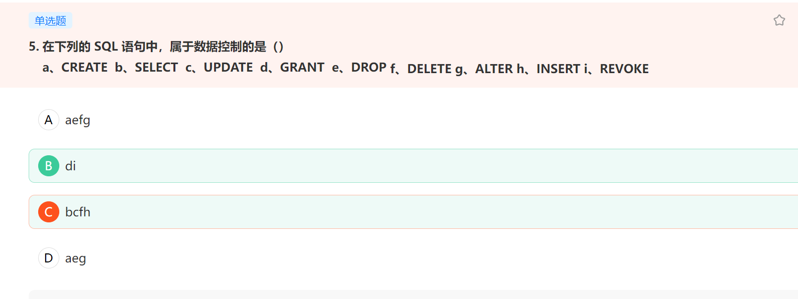
查询：SELECT
操纵：UPDATE,INSERT,DELETE
定义：CREATE,DROP
控制：COMMIT,ROLLBACK,GRANT等
操作就是增删改。控制就是权限，给用户赋权限grant，去掉某权限revoke

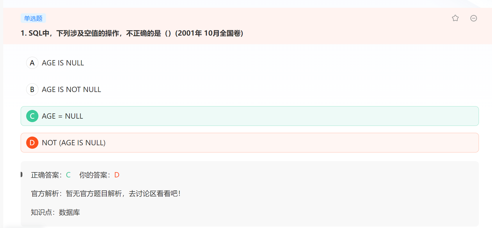
sql 不能直接赋null

以下属于事务的特性的是 :隔离性，原子性，一致性，持久性

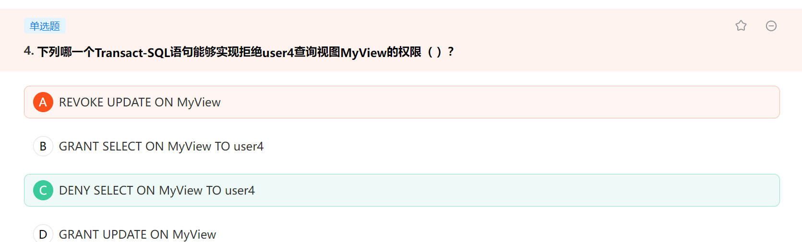

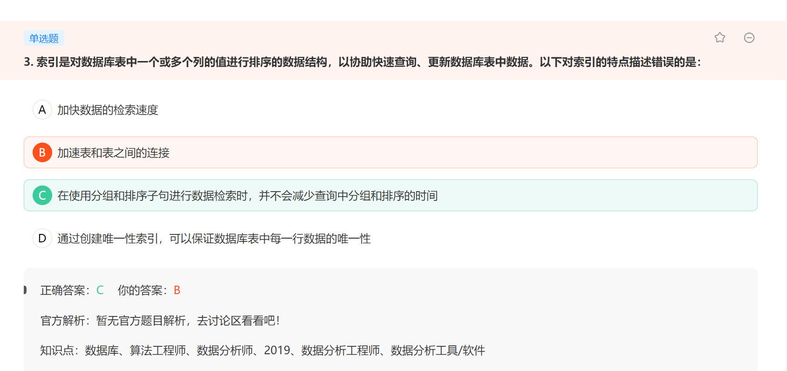
在使用分组和排序子句进行数据检索时,可以减少查询中分组和排序的时间

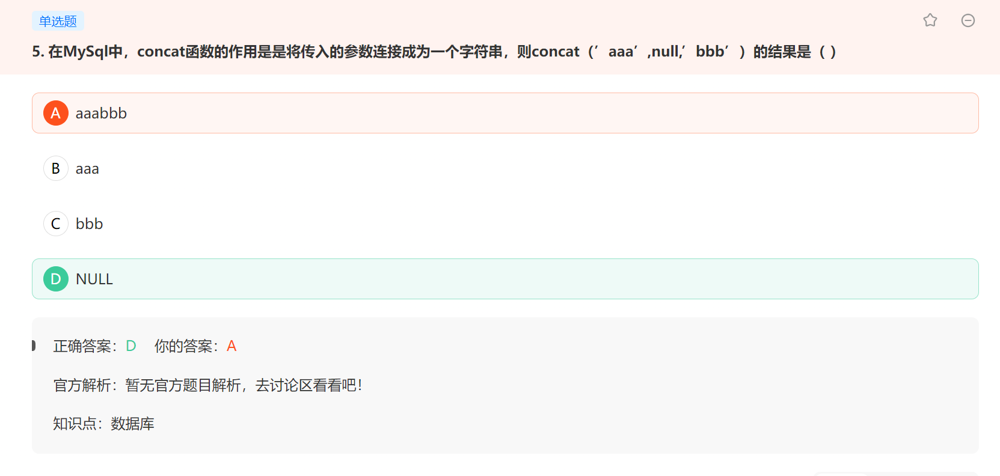
CONCAT合并字符串，只要有一个字符串为空，则输出为空；CONCAT_WS合并字符串，只要第一个字符串不为空，则输出不为空。


## Go语言语法注意事项
#### 数组篇

> Numbers := [5]int{2:5,3:6}  a:b a为下标，b为数值 

```go 
package main

import "fmt"

func main() {
	Numbers := [...]int{1, 2, 3, 4, 5}
	fmt.Println(Numbers[3])
}
```
冒号为自定义数组长度

另一种赋值
```go
package main

import "fmt"

func main() {
	var Numbers [5]int
	Numbers[0] = 1
	Numbers[1] = 2
	Numbers[3] = 3
	fmt.Println(Numbers[3])
}
```
循环赋值
```go
package main

func main() {
	var Numbers [5]int
	for i := 0; i < len(Numbers); i++ {
		Numbers[i] = i + 1
	}
}
```
遍历
```go 
Numbers := [...]int{1, 2, 3, 4, 5, 6, 7}
	for i := 0; i < len(Numbers); i++ {
		fmt.Println(Numbers[i])
	}

Numbers := [...]int{1, 2, 3, 4, 5, 6, 7}
	for _, number := range Numbers {    _为下标 number为值
		fmt.Println(number)
	}
```
数组作为函数的参数
```go 
func main() {
	var Numbers [5]int = [5]int{1, 20, 3, 4, 5}
	getPrint(Numbers)
}

func getPrint(n [5]int) {
	for _, i2 := range n {
		fmt.Println(i2)
	}  //函数中修改数组的值，不会影响到原数组
```
比较数组
```go 
package main

import "fmt"

func main() {
	Numbers := [...]int{1, 2, 3, 444, 4}
	Numbers2 := [...]int{1, 2, 3, 444, 4}
	b := Compex(Numbers[:], Numbers2[:])
	if b {
		fmt.Println("一致")
	} else {
		fmt.Println("不一致")
	}
}

func Compex(n1 []int, n2 []int) bool {
	var b bool = true
	if len(n1) == len(n2) {
		for i := 0; i < len(n1); i++ {
			if n1[i] == n2[i] {
				continue
			} else {
				b = false
				break
			}
		}
	} else {
		b = false
	}
	return b
}
//你可以将Compex函数的参数类型从[...]int改为[]int，这样就可以接受任意大小的数组或切片作为参数。然后，你可以在调用Compex函数时，将数组转换为切片。

//在Go语言中，函数参数的类型不能是具体大小的数组，因为在Go语言中，不同大小的数组被视为不同的类型
```
数组求和平均值
```go 
package main

import "fmt"

func main() {
	Numbers := [...]int{1, 2, 3, 444, 4}
	b := Svg(Numbers[:])
	fmt.Println(b)
}

func Count(n []int) int {  //求和
	sum := 0
	for i := 0; i < len(n); i++ {
		sum = sum + n[i]
	}
	return sum
}

func Max(nums []int) (max int) {  //最大
    max = nums[0]
    for _, num := range nums {
        if num > max {
            max = num
        }
    }
    return max
}

func Svg(n []int) int {   //平均
	sum := 0
	for i := 0; i < len(n); i++ {
		sum = sum + n[i]
	}
	svg := sum / len(n)
	return svg
}
```
选取最大的字符串
```go 
package main

import "fmt"

func main() {
	Numbers := [...]string{"111111", "您好哈哈哈哈哈杀杀杀"}

	max := Numbers[0]
	for _, number := range Numbers {
		if number > max {
			max = number
		}
	}
	fmt.Println(max)
}
```
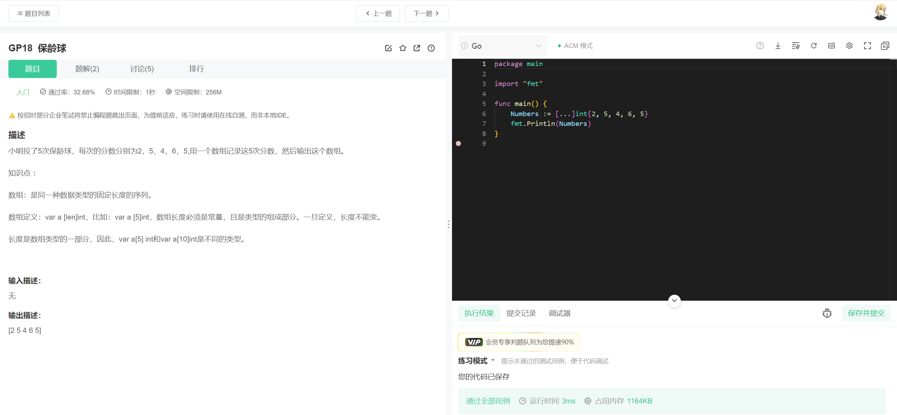

> 吐槽一下牛客网太简单

#### 切片篇

var s[]int  或者 s:=[]int{}

> 用make函数创建切片

```go 
s:=make([]int,3,5)      //3为长度，5为容量（初始化+空闲） 长度不能大于容量
```
容量可以省略
```go 
s:=make([]int,3)
```
cap()函数查询容量

另外一个案例 
```go 
package main

import "fmt"

func main() {
	s := make([]int, 3)
	s = append(s, 1, 3, 4, 5)
	fmt.Println(s)
}
```
append函数不会改变原始切片的长度，而是创建一个新的切片，其内容包含原始切片的所有元素，再加上append的参数。因此，append的结果是一个新的切片，其内容是[0 0 0 1 3 4 5]。如果你想创建一个新的切片，然后再向其添加元素s := []int{}

修改切片的值

```go 
s := make([]int, 0)
	s = append(s, 1, 3, 4, 5)
	s[2] = 88
	fmt.Println(s)
```
切片的遍历
```go 
package main

import "fmt"

func main() {
	s := make([]int, 0)
	s = append(s, 1, 3, 4, 5)
	for i := 0; i < len(s); i++ {
		fmt.Print(s[i])
	}
	fmt.Println()
	for _, i2 := range s {
		fmt.Print(i2)
	}
}
```

切片截取
```go 
s:= []int{1,2,3,4,5,6,7,8}
s1:= s[0:3:5]  //最后一个为长度
//容量:最后一个减去第一个
//长度：第二个减去第一个
s[:]  //全部到len(s)-1
package main

import "fmt"

func main() {
	s := make([]int, 0)
	s = append(s, 1, 3, 4, 5, 6, 7, 8, 9, 10)
	fmt.Println(s[2:5])
}
//前面的2，你可以理解为从头到2数 ，后面的5从5-2，然后取中间的
```
切片截取后返回新切片，对新切片的值进行修改，会影响原切片，当你从一个切片中截取一个新的切片时，新的切片和原始切片会共享同一个底层数组。这意味着，如果你修改新切片的元素，那么这些修改也会影响到原始切片。

切片扩容：一般超过容量以后为：容量*2，如果超过1024，每次扩容上一次的1/4

copy函数
copy(切片1，切片2)
```go 
package main

import "fmt"

func main() {
	s := make([]int, 0)
	s = append(s, 1, 3, 4, 5, 6, 7, 8, 9, 10)
	s2 := make([]int, 0)
	s2 = append(s2, 1, 3, 5, 7)
	fmt.Println(copy(s, s2))
}
//copy的原型是func copy(dst, src []Type) int，其中dst是目标切片，src是源切片。copy函数会返回实际复制的元素数量。
//copy函数的行为如下：
如果目标切片的长度小于源切片的长度，copy函数只会复制目标切片长度的元素。
如果目标切片的长度大于或等于源切片的长度，copy函数会复制源切片的所有元素。
```
牛客网刷题
1
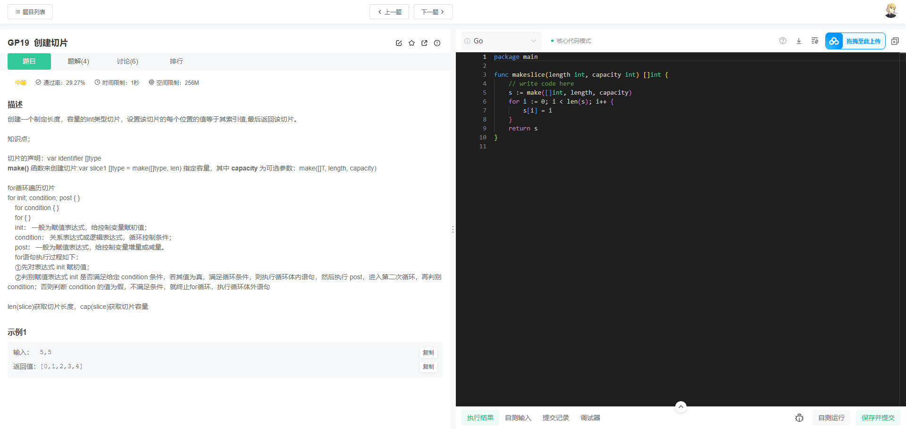
2
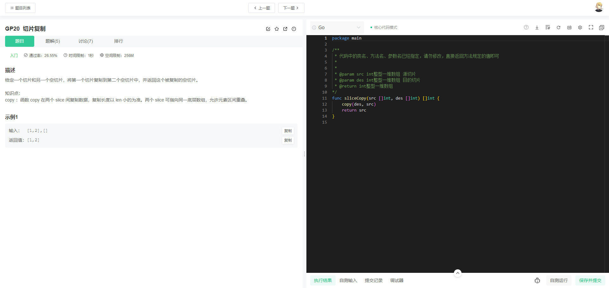
3
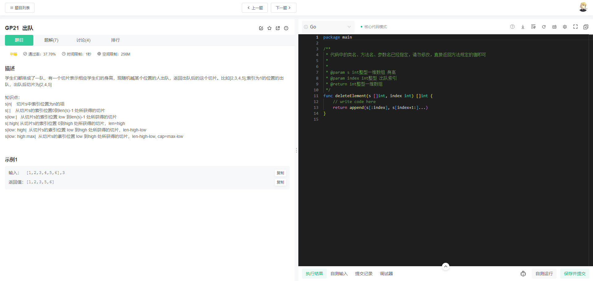
4
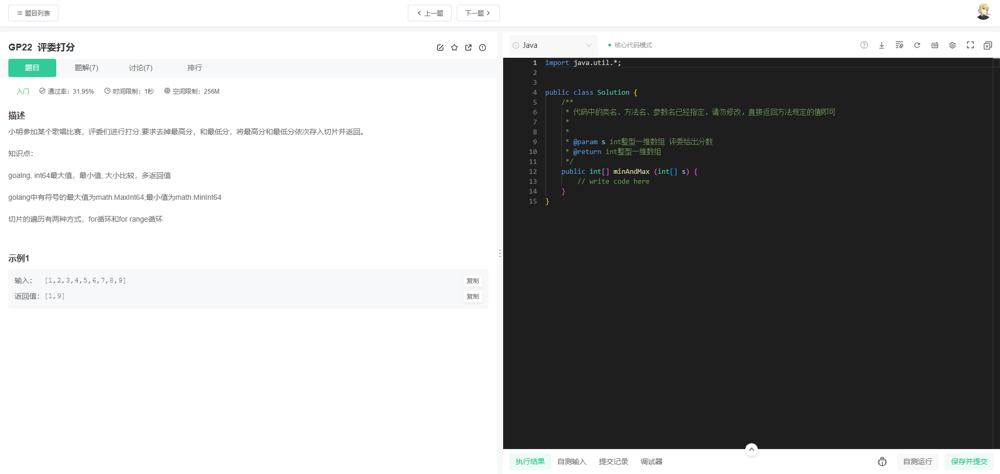
5
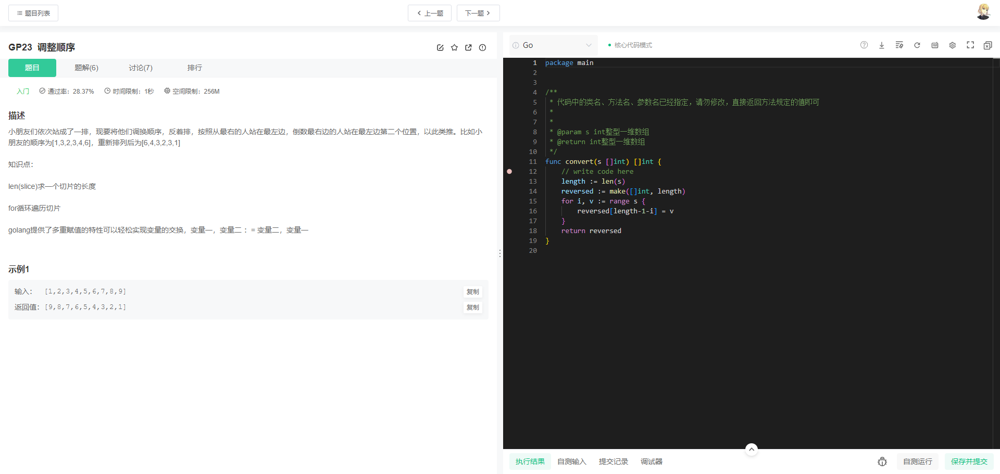
6
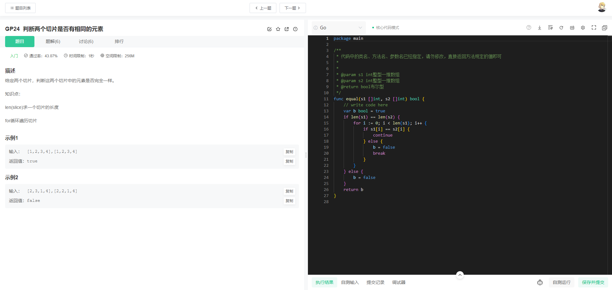
7
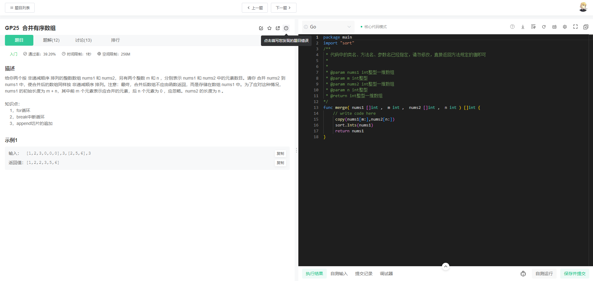
8
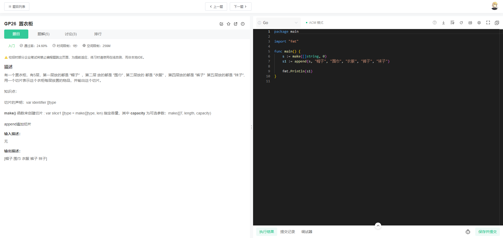

### Map相关知识点

map创建
```go 
var m map[int]string = map[int]string{1:"hello",2:"world"}
m1 := map[int]string{}
m2 := make(map[string]int)
```
键是唯一的，不能出现两个，map是无序的
```go 
package main

import "fmt"

func main() {
	m1 := make(map[int]string)
	m1[1] = "hello"
	m1[2] = "world"
	fmt.Println(m1[1] + " " + m1[2])

	m2 := map[int]string{1: "hello", 2: "world"}
	fmt.Println(m2[1])
}
```
通过key获取值时，判断是否存在
```go 
m2 := map[int]string{1: "hello", 2: "world"}
	
	v, o := m2[1]
	if o {
		fmt.Println(v)
	} else {
		fmt.Println("不存在")
	}
```
for range的遍历
```go 
package main

import "fmt"

func main() {
	//m1 := make(map[int]string)
	//m1[1] = "hello"
	//m1[2] = "world"
	//fmt.Println(m1[1] + " " + m1[2])

	m2 := map[int]string{1: "hello", 2: "world"}

	for _, s := range m2 {
		fmt.Println(s)
	}

	for i, s := range m2 {
		fmt.Println(i)
		fmt.Println(s)
	}
}
```
删除操作
```go 
m2 := map[int]string{1: "hello", 2: "world"}

delete(m2, 2)

fmt.Println(m2)
```
作为函数参数操作
```go 
package main

import "fmt"

func main() {

	m := map[int]string{1: "hello", 2: "world"}
	Printmaking(m)

}

func Printmaking(m map[int]string) {
	fmt.Println(m)
}
```
在函数中修改map的值，会影响到原map


案例：有一个英文字符串 统计每个字母出现的次数,包含语法糖
```go 
package main

import (
	"fmt"
	"strings"
)

func countChars(s string) map[rune]int {
	counts := make(map[rune]int)
	for _, char := range strings.ToLower(s) {
		if char >= 'a' && char <= 'z' {
			counts[char]++
		}
	}
	return counts
}

func main() {
	s := "Hello World"
	fmt.Println(countChars(s)) // 输出：map[104:1 101:1 108:3 111:2 119:1 114:1 100:1]
}
```
牛客网刷题
1
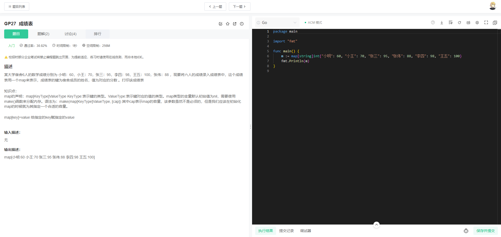

### Go结构体
定义
```go 
type Student struct {
	id   int
	name string
	age  int
	addr string
}
```
```go 
type Student struct {
		id   int
		name string
		age  int
		addr string
	}
	var s Student = Student{101, "hello", 12, "北京"}
	fmt.Println(s)

//部分初始化
var s1 Student = Student{name:"111",age:18}
```
```go 
package main

import "fmt"

func main() {
	type Student struct {
		id   int
		name string
		age  int
		addr string
	}
	var s Student
	s.name = "ss"
	s.age = 18
	fmt.Println(s)
}
```
结构体与数组

这个例子中我们将创建一个结构体表示学生，然后创建一个学生的数组，切片和map。然后，我们将创建一个函数来处理这些数据。

首先，我们定义一个学生的结构体：

```go
type Student struct {
    ID   int
    Name string
}
```

然后，我们可以创建一个学生的数组和切片：

```go
// 创建一个学生数组
studentsArray := [2]Student{
    {1, "Alice"},
    {2, "Bob"},
}

// 创建一个学生切片
studentsSlice := []Student{
    {3, "Charlie"},
    {4, "David"},
}
```

我们也可以创建一个以学生ID为键，学生对象为值的map：

```go
// 创建一个学生map
studentsMap := map[int]Student{
    5: {5, "Eve"},
    6: {6, "Frank"},
}
```

然后，我们可以创建一个函数来打印学生的名称。这个函数可以接受一个学生的数组，切片或者map：

```go
func printNames(students interface{}) {
    switch v := students.(type) {
    case [2]Student:
        for _, student := range v {
            fmt.Println(student.Name)
        }
    case []Student:
        for _, student := range v {
            fmt.Println(student.Name)
        }
    case map[int]Student:
        for _, student := range v {
            fmt.Println(student.Name)
        }
    default:
        fmt.Println("Unsupported type")
    }
}
```

这个函数使用了类型断言和类型选择，这是Go语言中处理接口类型的一种方式。函数接受一个空接口类型的参数，然后使用类型选择来确定参数的实际类型，并根据类型执行不同的操作。

最后，我们可以在main函数中调用这个函数，并传入我们创建的数组，切片和map：

```go
func main() {
    printNames(studentsArray)
    printNames(studentsSlice)
    printNames(studentsMap)
}
```

这个程序将打印出所有学生的名称。
牛客网刷题
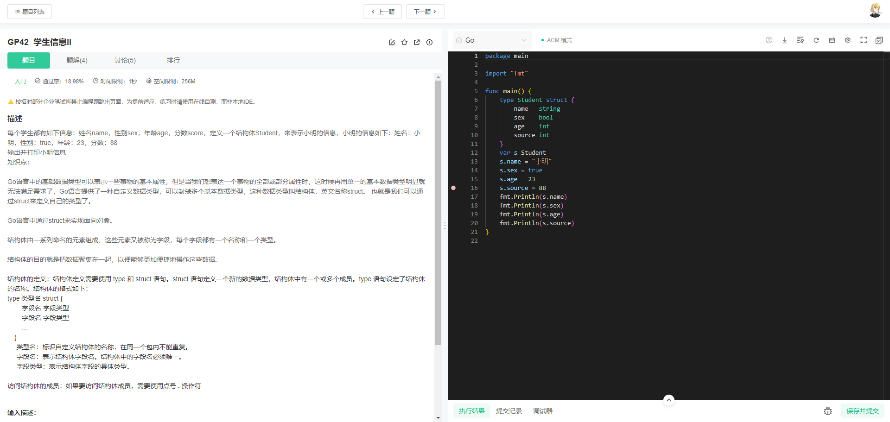
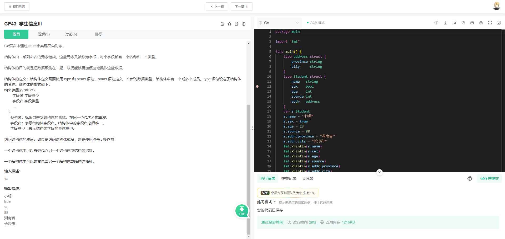